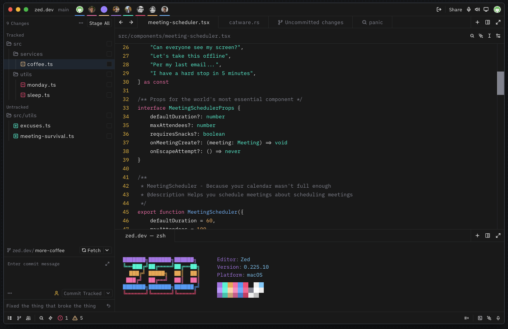
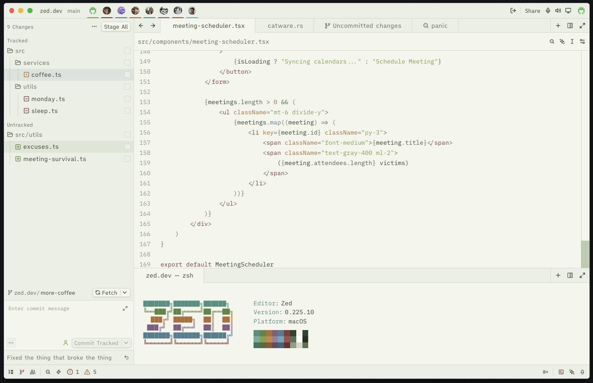

# Shizuka Japan

A serene Zed IDE theme inspired by the tranquility of Japanese aesthetics — perfect for focused, late-night coding sessions or bright productive mornings.

## The Meaning of "Shizuka" (静か)

**Shizuka** (静か) is a Japanese word meaning *quiet*, *calm*, or *peaceful*. This theme embodies that essence through:

- **Deep, muted backgrounds** — Like the stillness of a Kyoto night
- **Soft accent colors** — Gentle pops of color inspired by traditional Japanese aesthetics
- **Low contrast design** — Easy on the eyes during extended coding sessions
- **Three unique variations** — Each capturing a different moment of Japanese serenity

---

## 🎨 Theme Variations

### 🌙 Shizuka Japan (Dark)
*The original — inspired by Kyoto nights and neon-lit streets*



**Mood:** Mysterious, focused, immersive  
**Best for:** Late-night coding, low-light environments

The dark theme captures the essence of Japanese urban nights — the deep blacks of *sumi-e* ink paintings combined with the vibrant neon accents of Tokyo's backstreets. The high contrast keeps you alert while the muted background prevents eye strain during marathon coding sessions.

---

### 🌾 Shizuka Japan Light — Countryside
*Inspired by rural Japan's rice fields and bamboo forests*



**Mood:** Natural, grounded, refreshing  
**Best for:** Daytime coding, nature lovers, long reading sessions

The Countryside variation draws from the *satoyama* landscape — where human life and nature coexist in harmony. The sage greens represent young rice shoots (*naae*) and bamboo groves (*takebayashi*), while the warm earth tones evoke wooden farmhouses and sun-baked soil. This palette reduces blue light exposure while maintaining excellent readability.

**Key Colors:**
| Color | Hex | Inspiration |
|-------|-----|-------------|
| Matcha Green | `#8FA855` | Fresh tea leaves, young bamboo |
| Terracotta | `#8B4545` | Traditional *aka-raku* pottery |
| Earth Brown | `#B87840` | Wooden temples, farm tools |
| Mist Sage | `#F5F7F0` | Morning fog over rice paddies |

---

### 🌫️ Shizuka Japan Light — Morning Mist
*Inspired by dawn breaking over mountain hot springs*


**Mood:** Ethereal, calm, contemplative  
**Best for:** Early morning focus, creative work, meditation before code

Morning Mist captures *asagiri* — the mist that rises from valleys at dawn. The cool blue-grays mirror the steam from *onsen* hot springs, while the soft teals and aquas reflect the sky transitioning from night to day. This theme creates a serene atmosphere that helps maintain mental clarity and creative flow.

**Key Colors:**
| Color | Hex | Inspiration |
|-------|-----|-------------|
| Onsen Blue | `#4A9BB8` | Hot spring mineral waters |
| Dawn Gray | `#2D3748` | Mountains silhouetted against morning sky |
| Steam White | `#F0F5F8` | Rising mist, morning fog |
| Zen Teal | `#5BA8A0` | Traditional celadon ceramics |

---

## 📚 Complete Color Philosophy

### Dark Theme Palette

| Color | Hex | Usage | Inspiration |
|-------|-----|-------|-------------|
| Sakura Pink | `#FF75B5` | Keywords, variants | Cherry blossoms under moonlight |
| Mizu Blue | `#45A9F9` | Functions, links | Clear mountain streams |
| Aonori Cyan | `#19F9D8` | Strings, types | Sea green porcelain (*seiji*) |
| Kin Gold | `#F9C139` | Accents, line numbers | Warm lantern glow (*andon*) |
| Momiji Orange | `#FFB86C` | Constants, booleans | Autumn maple leaves |
| Neon Pink | `#FF4B82` | Errors, borders | Neon district signage |
| Sumi Black | `#1A1A1A` | Background | Japanese ink (*sumi-e*) |

### Light Theme Palettes

The light variations shift from the *yoru* (night) energy of the dark theme to *asa* (morning) tranquility:

**Countryside** emphasizes *shizen* (nature) with:
- **Greens** for growth, life, and balance
- **Earth tones** for stability and grounding
- **Low saturation** to reduce visual fatigue

**Morning Mist** emphasizes *seijaku* (stillness) with:
- **Cool blues** for clarity and focus
- **Soft grays** for neutrality and calm
- **Minimal contrast** for peaceful reading

---

## 🎭 The Psychology Behind Shizuka

### Design Principles

1. **Ma (間) — Negative Space**
   - Ample spacing in the color distribution
   - Background colors that recede, letting code breathe
   - Reduced visual clutter for better focus

2. **Wabi-Sabi (侘寂) — Imperfect Beauty**
   - Muted, desaturated colors rather than harsh primaries
   - Warm undertones that feel organic
   - Colors that age well during long sessions

3. **Shibui (渋い) — Subtle Refinement**
   - Complex, layered colors that reveal depth on closer inspection
   - No single color dominates; harmony through balance
   - Sophisticated without being flashy

### When to Use Each Theme

| Situation | Recommended Theme | Why |
|-----------|------------------|-----|
| Late night coding (10pm-3am) | **Dark** | High contrast, alertness, immersive |
| Afternoon deep work | **Countryside** | Natural energy, reduced eye strain |
| Morning planning/creative work | **Morning Mist** | Calm focus, gentle wake-up |
| Presenting code | **Countryside** | Projector-friendly, readable |
| Debugging complex issues | **Dark** | Maximum syntax distinction |
| Reading documentation | **Morning Mist** | Lowest eye fatigue |

---

## 🚀 Installation

1. Open Zed IDE
2. Go to Extensions
3. Search for "Shizuka Japan"
4. Click Install

### Manual Installation (for testing)

```bash
# Copy theme to Zed's local themes directory
cp themes/shizuka_japan.json ~/.config/zed/themes/

# Reload Zed and select theme via Cmd+K Cmd+T
```

---

## 🖼️ Concept Art

The themes were developed from these atmospheric reference images:

| Dark | Countryside & Morning Mist |
|------|---------------------------|
|  |  |
| *Neon-lit Kyoto alleyways* | *Rural Japanese countryside at dawn* |

### 📷 Image Credits

| Image | Photographer | Unsplash Profile |
|-------|-------------|------------------|
| Dark Theme Concept | **Clay Banks** | [@claybanks](https://unsplash.com/pt-br/@claybanks) |
| Countryside & Morning Mist Concept | **micheallight** | [@guoshiwushuang](https://unsplash.com/pt-br/@guoshiwushuang) |

*All reference images are sourced from Unsplash and used under the Unsplash License for inspiration and concept development.*

---

## 🤝 Contributing

Feel free to open issues or PRs if you have suggestions for color adjustments or want to propose additional variations.

---

## 📜 License

MIT

---

